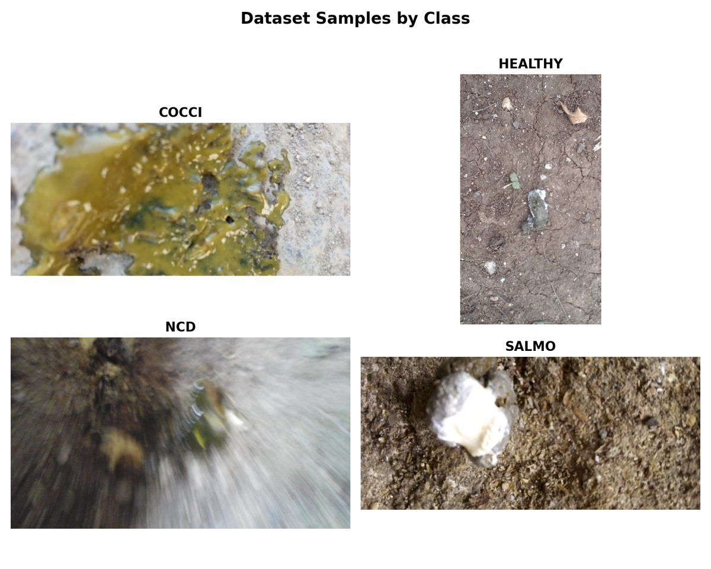
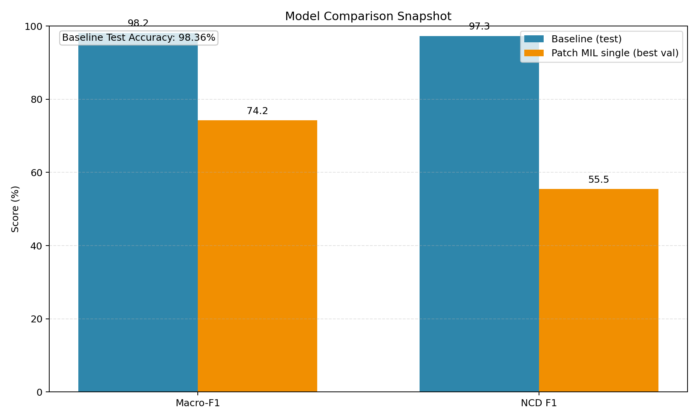

# Chicken Disease Classification: Why, What, How, and When

## Quick Summary (1 min)

This project builds an AI system to detect chicken diseases from images, so farms and veterinarians can spot issues earlier and reduce losses.

What was built:
1. A full training pipeline from raw image cleanup to model training and reporting.
2. Two model strategies: full-image classification and patch-based attention.
3. Reproducible scripts for local and SLURM-based training.

Key outcome:
1. The best production-ready model reached `98.36%` test accuracy.
2. The model also handled the minority `ncd` class strongly, with `0.973` F1 on test data.

Why it matters:
1. Faster disease detection can improve flock health decisions.
2. The work compares accuracy vs interpretability tradeoffs in a practical setting.

## Visual Snapshot


*Four sample images (one per class) from the processed dataset.*


*Baseline vs Patch MIL single model scores from local experiment artifacts.*

This repository compares two approaches for classifying poultry diseases:
1. Global single-image classification.
2. Patch-based multiple instance learning (MIL).

Target classes are `cocci`, `healthy`, `ncd`, and `salmo`.

## Why

Poultry disease screening needs models that are both accurate and reliable under class imbalance, especially for minority classes like `ncd`.

This project exists to answer one practical question:

Does a patch-attention MIL model outperform a strong global image classifier for this dataset?

The short answer from current experiments is: no. The global baseline is stronger overall, but MIL improves local attention and can be useful when lesion localization matters.

## What

This codebase currently provides:
1. Data ingestion with image validation and duplicate removal.
2. Data preprocessing into single-image splits and multi-image windows.
3. Baseline training (EfficientNet-B0 on full images).
4. Patch MIL training for single-image bags and multi-image windows.
5. JSON reports and model artifacts for reproducible experiments.

### Current Results Snapshot (Local Artifacts)

Numbers below come from local files in this workspace:
1. `reports/baseline_test_report.json`
2. `reports/baseline_val_report.json`
3. `reports/patch_mil_single_epoch_metrics.json`
4. `logs/patch_mil_single_1486170.out` (February 12, 2026)

| Model | Best Validation | Test | Notes |
| --- | --- | --- | --- |
| Baseline single (`efficientnet_b0`) | Macro-F1 `0.9901` | Accuracy `0.9836`, Macro-F1 `0.9816`, NCD F1 `0.9730` | Best overall performer in this repo. |
| Patch MIL single (`efficientnet_b3`) | Macro-F1 `0.7425` (epoch 30) | No dedicated test export in current training script | NCD F1 improved from `0.0` early to `0.6119` (epoch 50). |
| Patch MIL multi | No completed metrics artifact | No completed metrics artifact | Experimental path; earlier runs show data path issues in logs. |

## When

### When To Use Which Model

| Situation | Recommended Path |
| --- | --- |
| You need highest production accuracy now | Baseline single (`stage_03_train_single.py`) |
| You need patch-level attention and interpretability signals | Patch MIL single (`stage_04b_train_patch_mil_single.py`) |
| You need one prediction from a window of images | Patch MIL multi (`stage_04c_train_patch_mil_multi.py`, experimental) |

### When To Rerun Pipeline Stages

| Change | Stages To Rerun |
| --- | --- |
| New or modified raw images | Stage 01 + Stage 02 + training stage(s) |
| Only hyperparameters changed in `params.yaml` | Training stage(s) only |
| `config/config.yaml` paths changed | Affected stage(s), usually Stage 01 onward |
| Multi-image JSON has stale paths | Stage 02 (regenerate `data/processed/multi/*.json`) |

## How

### 1) Environment Setup

```bash
git clone <repo-url>
cd chicken_disease

python3 -m venv .venv
source .venv/bin/activate
python -m pip install --upgrade pip
pip install -r requirements.txt
pip install -e .

export PYTHONPATH="${PYTHONPATH:-}:$(pwd)/src"
```

Notes:
1. Python `3.10+` is expected.
2. GPU is strongly recommended for training.
3. `timm` pretrained weights are downloaded at runtime on first use.

### 2) Configure Paths

Edit `config/config.yaml` before running if your workspace is different from this machine.

Current file uses absolute paths:
1. `data.raw_dir`
2. `data.interim_dir`
3. `data.processed_dir`
4. `artifacts.model_dir`
5. `artifacts.reports_dir`

### 3) Prepare Raw Data

Expected class folders under `data/raw/`:

```text
data/raw/
  cocci/
  healthy/
  ncd/
  salmo/
```

Ingestion behavior (`src/chicken_disease/components/ingest.py`):
1. Accepts `.jpg`, `.jpeg`, `.png`.
2. Skips non-image files.
3. Verifies image integrity and drops corrupted files.
4. Removes duplicates by file hash.
5. Writes cleaned data to `data/interim/<class>/`.

Class names are normalized through `CLASS_MAP` in `src/chicken_disease/components/ingest.py`.

### 4) Run Data Pipeline

```bash
python src/chicken_disease/pipeline/stage_01_ingest.py
python src/chicken_disease/pipeline/stage_02_preprocess.py
```

Stage 02 outputs:
1. Single-image splits: `data/processed/single/{train,val,test}/<class>/`
2. Multi-image windows: `data/processed/multi/{train,val,test}.json`

Default split ratio is `70/15/15`, with multi-image window size `5`.

You can also run Stage 01-03 together:

```bash
python run_pipeline.py
```

### 5) Train Models

Baseline single-image:

```bash
python src/chicken_disease/pipeline/stage_03_train_single.py
```

Patch MIL single-image:

```bash
python src/chicken_disease/pipeline/stage_04b_train_patch_mil_single.py
```

Patch MIL multi-image:

```bash
python src/chicken_disease/pipeline/stage_04c_train_patch_mil_multi.py
```

Hyperparameters are controlled by `params.yaml`.

### 6) Inference

Single-image prediction:

```bash
python src/chicken_disease/Prediction/predict_single.py /path/to/image.jpg
```

Multi-image MIL prediction:

```bash
python src/chicken_disease/Prediction/predict_multi_mil.py img1.jpg img2.jpg img3.jpg img4.jpg img5.jpg
```

Important:
`predict_single.py` currently contains hard-coded model/class-map paths. Update those constants if your local paths differ.

### 7) Run On SLURM

```bash
sbatch train_single.slurm
sbatch train_patch_mil_single.slurm
sbatch train_patch_mil_multi.slurm
```

Logs are written to `logs/`.

## Data and Hyperparameter Context

### Current Dataset Snapshot in This Workspace

After ingestion (`data/interim`):
1. `cocci`: 1970 images
2. `healthy`: 2054 images
3. `ncd`: 374 images
4. `salmo`: 2096 images

Single-image splits (`data/processed/single`):
1. Train: `1378 / 1437 / 261 / 1467`
2. Val: `296 / 308 / 56 / 314`
3. Test: `296 / 309 / 57 / 315`
4. Class order shown above is `cocci / healthy / ncd / salmo`

Multi-image windows (`data/processed/multi`):
1. Train: `907` windows
2. Val: `193` windows
3. Test: `194` windows

### Default Hyperparameters (`params.yaml`)

`train_single`:
1. `model_name: efficientnet_b0`
2. `image_size: 224`
3. `batch_size: 64`
4. `lr: 3e-4`
5. `epochs: 100`

`patch_mil`:
1. `patch_size: 224`
2. `stride: 112`
3. `max_patches_per_image: 32`
4. `model_name: efficientnet_b3`
5. `batch_size: 4`
6. `lr: 3e-4`
7. `epochs: 100`
8. `patience: 20`
9. `mc_dropout_passes: 20`

## Artifacts Produced

Typical outputs:
1. `models/baseline_single/model.pt`
2. `models/baseline_single/class_map.json`
3. `models/patch_mil_single/model.pt`
4. `models/patch_mil_single/class_map.json`
5. `reports/baseline_val_report.json`
6. `reports/baseline_test_report.json`
7. `reports/baseline_epoch_metrics.json`
8. `reports/patch_mil_single_epoch_metrics.json`
9. `logs/*.out` and `logs/*.err`

## Troubleshooting

1. `FileNotFoundError: data/processed/multi/train.json`
Cause: Stage 02 not run or wrong `config/config.yaml` paths.
Fix: Run Stage 02 again after verifying config paths.

2. `FileNotFoundError` for images inside `data/interim/...` during multi training
Cause: `data/processed/multi/*.json` points to stale paths from an older preprocessing run.
Fix: Rerun Stage 02 to regenerate JSON metadata.

3. `ModuleNotFoundError: chicken_disease`
Cause: package not installed or missing `PYTHONPATH`.
Fix: run `pip install -e .` and export `PYTHONPATH` as shown above.

4. Poor MIL performance on minority class
Current mitigations already in code:
1. Weighted cross-entropy.
2. Initial backbone freezing.
3. Differential learning rates after unfreezing.

## Repository Status and Gaps

Implemented and active:
1. `components/ingest.py`, `components/preprocess.py`
2. `pipeline/stage_01`, `stage_02`, `stage_03`, `stage_04b`, `stage_04c`
3. `training/train_single.py`, `training/train_patch_mil_single.py`, `training/train_patch_mil_multi.py`
4. `models/attention_mil.py`

Currently placeholders or empty modules:
1. `src/chicken_disease/pipeline/stage_04_train_multi.py`
2. `src/chicken_disease/pipeline/stage_05_evaluate.py`
3. `src/chicken_disease/training/train_multi.py`
4. Multiple files in `evaluation/`, `explainability/`, and app entrypoints

## Project Structure

```text
.
├── config/
├── data/
├── logs/
├── models/
├── reports/
├── src/chicken_disease/
│   ├── components/
│   ├── datasets/
│   ├── losses/
│   ├── models/
│   ├── pipeline/
│   ├── training/
│   └── utils/
├── params.yaml
├── run_pipeline.py
└── README.md
```

## Citation

```bibtex
@misc{chicken_disease_project,
  author = {Parimalnath Reddy},
  title = {Chicken Disease Classification: Global vs Patch MIL},
  year = {2026}
}
```
